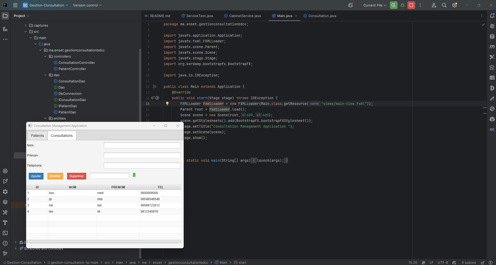
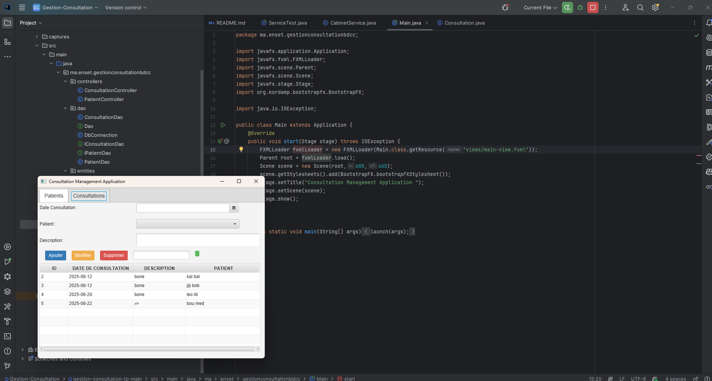

# 🏥 Gestion des Consultations - JavaFX  

Une application JavaFX permettant de gérer les consultations et les patients de manière simple et efficace.  

## 📌 Objectif  
Développer une interface graphique pour **ajouter, modifier, supprimer et afficher** les patients et leurs consultations.  

## 🛠️ Fonctionnalités  

**Gestion des Patients**
- Ajouter
- Modifier
- Supprimer
- Rechercher

**Gestion des Consultations**
- Ajouter
- Modifier
- Supprimer
- Rechercher

## 🎥 Captures d'écran
- Ajout d'un patient

- Ajouter une consultation

- 

